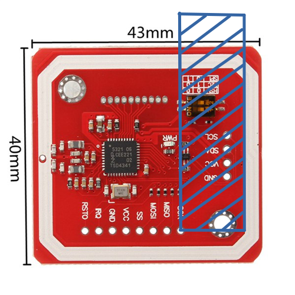
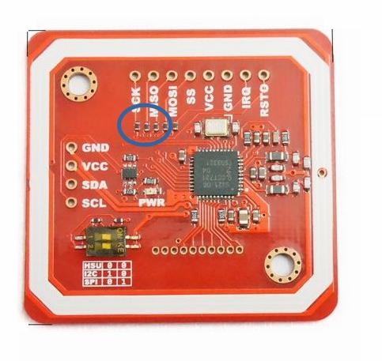

# pn532-library-arduino-I2C-SPI
Libreria I2C/SPI per la lettura/scrittura dei tag SRIX4K con Arduino

# Istruzioni
I due file della libreria (PN532_srix4k.cpp e PN532_srix4k.h presenti nella cartella pn532) devono essere copiati nella cartella del vostro sketch. È presente uno sketch di esempio (pn532.ino) che mostra tutte le funzioni che possono essere usate.

## I2C
Per usare il PN532 in modalita I2C dovete:
  - Settare i due switch della board per la modalità I2C
  - Collegare SDA e SCL ai rispettivi pin della board Arduino
  - Impostare il define "USE_SPI" dello sketch (riga 6 di pn532.ino) a 0

## SPI
Per usare il PN532 in modalita SPI dovete:
  - Settare i due switch della board per la modalità SPI
  - Collegare SS al pin 10 di Arduino
  - Collegare MOSI al pin 11 di Arduino
  - Collegare MISO al pin 12 di Arduino
  - Collegare SCK al pin 13 di Arduino
  - Impostare il define "USE_SPI" dello sketch (riga 6 di pn532.ino) a 1

## Opzioni
  - È possibile cambiare il pin usato per SS usando il define "PN532_SS" (riga 5 di pn532.ino)
  - La modalità DEBUG (vengono mostrati sulla porta seriale i frame ricevuti/trasmessi) si può abilitare impostando a 1 il define "DEBUG" (riga 4 di PN532_srix4k.h)
  - È possibile aumentare il tempo di attesa della risposta I2C/SPI aumentando il valore del define TIMEOUT (riga 5 di PN532_srix4k.h)

## Problemi
  - Su alcune board la lettura dei tag SRIX4K è problematica: solo se il tag viene messo in una posizione particolare (**SOTTO** la board, spostato a "destra" come nella foto indicato in blu) si riesce a leggere correttamente. Non è un problema della libreria ma della qualità della board  
  
  - Su una board mi è capitato di trovare dei valori sbagliati delle resistenze su SCK/MISO/MOSI/SS (quelle cerchiate in blu nell'immagine sotto). Il loro valore deve essere di 100 Ohm  
  

